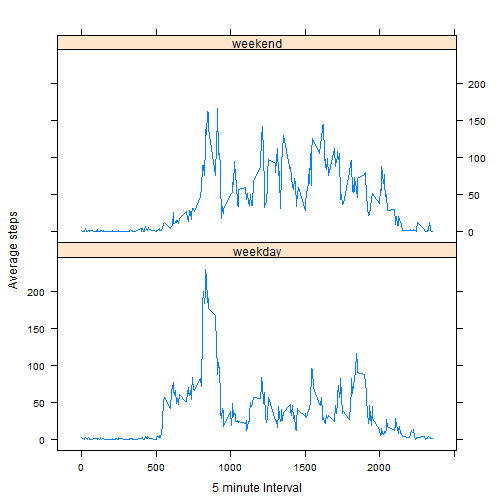

## Loading and preprocessing the data

```r
## Assumes that activity.zip is in the working directory
unzip("activity.zip","activity.csv")
all_data<-read.csv("activity.csv",sep=",",header=TRUE,na.strings="NA")
all_data$date<-as.Date(all_data$date,"%Y-%m-%d")
```


## What is mean total number of steps taken per day?


```r
## Calculate the total number of steps taken per day
sum_by_date<-aggregate(all_data$steps, by=list(all_data$date), sum)

## Make a histogram of the total number of steps taken each day
hist(sum_by_date$x, xlab="Steps Taken Per Day", main="Histogram of Steps")
```

 

```r
## Calculate and report the mean and median of the total number of steps taken per day
step_mean<-mean(sum_by_date$x, na.rm=TRUE) 
print(step_mean)
```

```
## [1] 10766
```

```r
step_median<-median(sum_by_date$x, na.rm=TRUE)
print(step_median)
```

```
## [1] 10765
```


## What is the average daily activity pattern?


```r
## Make a time series plot (i.e. type = "l") of the 5-minute interval (x-axis) and the average number of steps
## taken, averaged across all days (y-axis)
avg_by_interval<-aggregate(all_data$steps, by=list(all_data$interval), mean, na.rm=TRUE)
colnames(avg_by_interval) <-c("interval", "avgSteps")
avg_by_interval$interval<-as.character(avg_by_interval$interval)
plot(avg_by_interval$interval, avg_by_interval$avgSteps,
     ylab="Average Steps",
     xlab="5 minute Interval",
     type="l")
```

 

```r
##Which 5-minute interval, on average across all the days in the dataset, contains the maximum number of steps?
avg_by_interval[which.max(avg_by_interval$avgSteps),]
```

```
##     interval avgSteps
## 104      835    206.2
```


## Imputing missing values
Note that there are a number of days/intervals where there are missing values (coded as NA). The presence of missing days may introduce bias into some calculations or summaries of the data.

```r
## Calculate and report the total number of missing values in the dataset (i.e. the total number of rows with NAs)
sum(is.na(all_data$steps))
```

```
## [1] 2304
```

Strategy for filling in all of the missing values in the dataset. I choose to replace the NA with the mean for the 5-minute interval.


```r
## Create a new dataset that is equal to the original dataset but with the missing data filled in.
library(plyr)
## Function to replace with the interval mean
interval.mean <- function(x) replace(x, is.na(x), mean(x, na.rm = TRUE))
## Use ddply to split and replace NAs with the mean
all_data_no_NA <- ddply(all_data, ~ interval, transform, steps = interval.mean(steps))
## Put it back in date order
all_data_no_NA<-all_data_no_NA[order(all_data_no_NA$date), ]
```


```r
## Calculate the total number of steps taken per day
sum_by_date<-aggregate(all_data_no_NA$steps, by=list(all_data_no_NA$date), sum)

## Make a histogram of the total number of steps taken each day
hist(sum_by_date$x, xlab="Steps Taken Per Day", main="Histogram of Steps")
```

 

```r
## Calculate and report the mean and median of the total number of steps taken per day
step_mean_no_NA<-mean(sum_by_date$x) 
print (step_mean_no_NA)
```

```
## [1] 10766
```

```r
step_median_no_NA<-median(sum_by_date$x)
print(step_median_no_NA)
```

```
## [1] 10766
```

Do these values differ from the estimates from the first part of the assignment? What is the impact of imputing missing data on the estimates of the total daily number of steps?

```r
## Setting R option for display of numbers that Knitr uses for inline output
## default is to display in scientific notation if number is bigger than 10^4
options(scipen=1, digits=2)
```

Mean from first part is 10766.19, and mean from this part is 10766.19  
Median from first part is 10765, and median from this part is 10766.19  
Conclusion: There is minimal impact on replacing the NAs with the 5-minute interval mean.

## Are there differences in activity patterns between weekdays and weekends?

```r
## Create a new factor variable in the dataset with two levels - "weekday" and "weekend" indicating 
## whether a given date is a weekday or weekend day.
all_data_no_NA<-transform(all_data_no_NA, weekdaytxt=(weekdays(date)))
all_data_no_NA<-transform(all_data_no_NA, weekday=(ifelse (weekdays(date) %in% c('Sunday', 'Saturday'), 'weekend', 'weekday')))
all_data_no_NA$weekday<-as.factor(all_data_no_NA$weekday)

## Make a panel plot containing a time series plot (i.e. type = "l") of the 5-minute interval (x-axis) ## and the average number of steps taken, averaged across all weekday days or weekend days (y-axis).
avg_by_interval<-aggregate(steps~interval+weekday, data=all_data_no_NA, mean)
library(lattice)
xyplot(steps ~interval | weekday, 
       data= avg_by_interval,
       layout = c(1,2),
       type = "l", 
       xlab="5 minute Interval", ylab="Average steps", 
       main="Average steps taken per day"
       )
```

 

